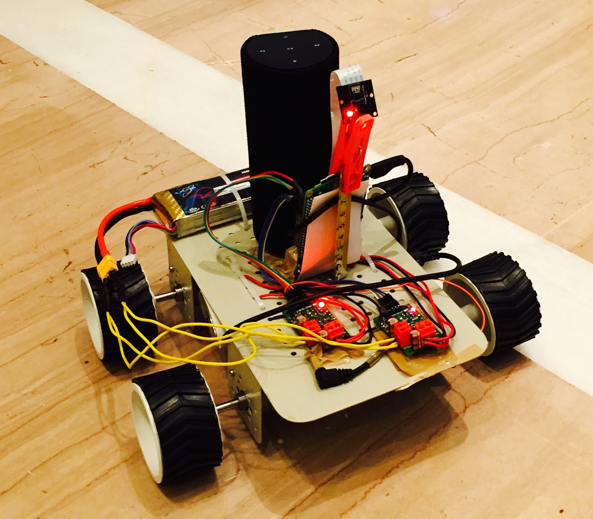

# DobbyBot
Sequoia Hack Bot called Dobby, a personal elf robot for you to stay lazy.

  

## Video

## Current Features
1. Voice Controlled W-S-A-D using [Amazon Alexa](https://developer.amazon.com/alexa).
2. Using [IFTT and Adafrut IO](https://learn.adafruit.com/using-ifttt-with-adafruit-io/ifttt-to-adafruit-io-setup) for RasPi GPIO Access.

## TODO
Check [issues](https://github.com/sam17/Dobby/issues) for new-upcoming features. Feel free to add more.

## Contributors
1. [Soumyadeep Mukherjee](@sam17)  
2.  [Aditya Agarwal](@aditya2592)
